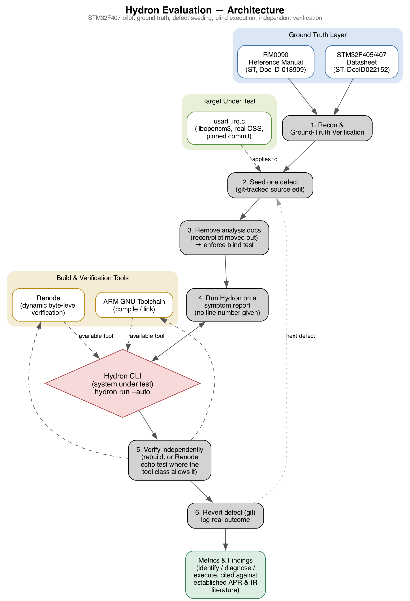
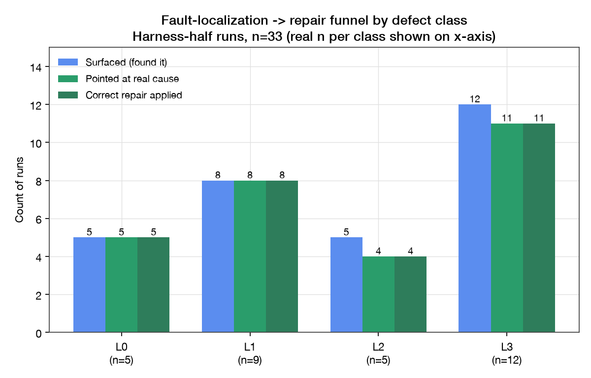
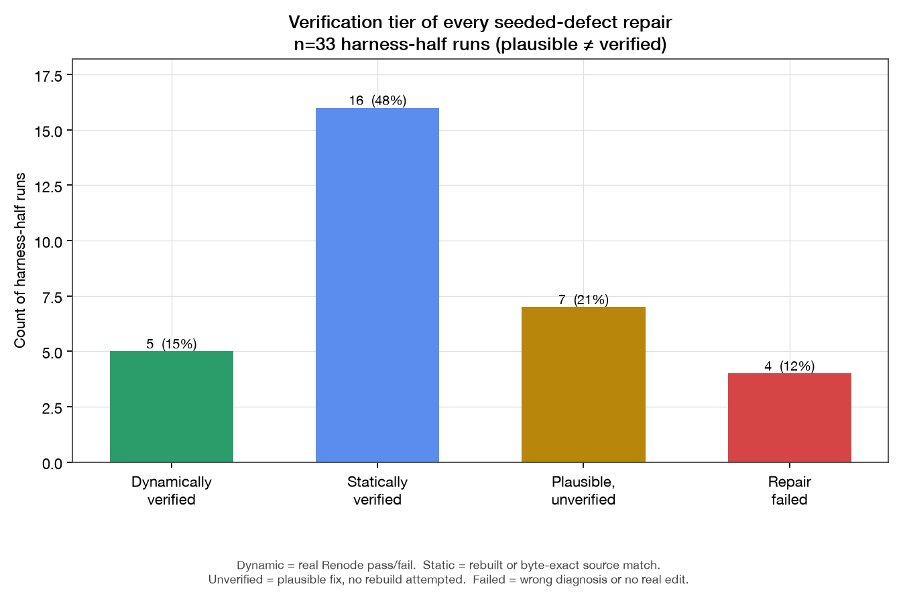
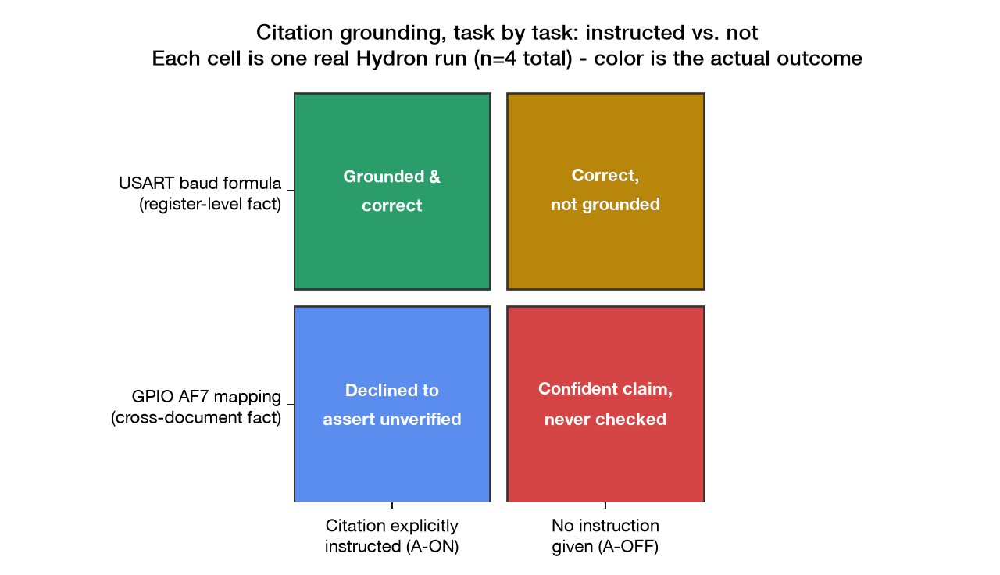
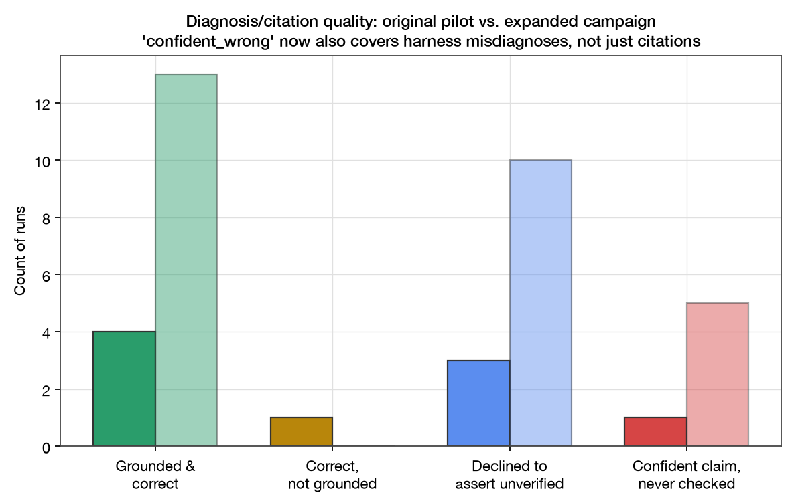
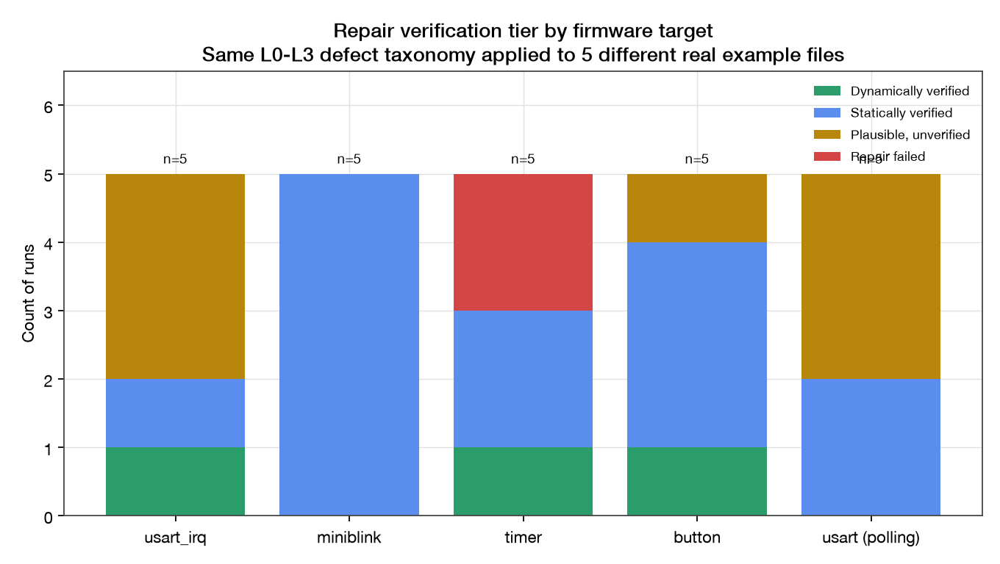

# Hydron Evaluation

An independent evaluation of **Hydron** (H2Loop), a hardware-aware AI coding
assistant for embedded engineers.

Two questions:

- Does Hydron's output actually ground in real hardware documentation?
- Can Hydron's execution harness locate, diagnose, fix, and verify a real
  defect in real firmware?

Every claim here traces to a real, re-runnable test or a cited page in a
real reference document.

---

## Contents

- [Target and setup](#target-and-setup)
- [Methodology](#methodology)
- [Findings](#findings)
- [Quantitative metrics](#quantitative-metrics)
- [Results](#results)
- [Approaches to improve Hydron's execution harness](#approaches-to-improve-hydrons-execution-harness)
- [Threats to validity](#threats-to-validity)
- [Repository structure](#repository-structure)
- [References](#references)

---

## Target and setup

A real **STM32F407** microcontroller running real open-source firmware
(`libopencm3`), checked against STMicroelectronics' official reference
manual and datasheet. Every hardware fact used in this evaluation is
traceable to one of those documents, with a section and page number.

**Toolchain:** ARM GNU Toolchain, `make`, QEMU, and
[Renode](https://renode.io) (Antmicro, open source) for dynamic, byte-level
verification of runtime behavior. Environment setup is scripted and
reproducible (`stm32-pilot/setup.sh`).

## Methodology

Each test followed the same pipeline:

1. **Recon.** Map the real firmware precisely, with exact file:line references.
2. **Ground truth.** Verify every hardware fact against an official manufacturer document, never from an AI's own knowledge.
3. **Controlled fault injection.** Introduce exactly one defect at a time, under version control.
4. **Blind execution.** Remove all internal analysis material before invoking Hydron, so it investigates from the symptom alone.
5. **Independent verification.** Confirm the outcome by rebuilding and, where possible, by dynamic emulation, not by trusting Hydron's own account of success.
6. **Revert and log.** Return to a clean baseline and record the real, observed outcome.

Tests separated three capabilities a single pass/fail result would blur:

| Capability | What it isolates |
|---|---|
| **Identify** | Locate the correct file/line from a symptom alone |
| **Diagnose** | Explain why the symptom occurs, correctly |
| **Execute** | Use its own tools correctly and recover from its own mistakes |

Exact defects, prompts, and seeding procedure are intentionally not
reproduced here. They're kept in the private working files, not a public
write-up.

## Findings

- **Identification is reliable.** Hydron correctly localized the true
  defect from a symptom description alone across every test, including
  defect types not encountered elsewhere in this evaluation.

- **Diagnosis is strong but not gated on the premise being true.** When a
  real defect was present, Hydron's causal explanations were consistently
  correct. Diagnosis and verifying the report is real are treated as the
  same step. They are not.

- **The most significant finding: no reproduce-before-fix behavior.** Given
  a fabricated bug report describing a symptom that could not physically
  occur in the working code provided, Hydron did not attempt to confirm the
  symptom existed. It produced a plausible-sounding explanation and
  modified working code to "fix" a defect that was never there.

- **Execution reliability is the weakest of the three capabilities.**
  Self-correction did not consistently use the simplest, documented fix. In
  one case, Hydron modified shared build configuration rather than
  supplying a missing parameter the tool's own error message named
  directly. In another, its own summary described a change as applied when
  no edit was ever made.

- **Citation behavior depends on whether a source was checked, not on
  whether the answer is correct.** When explicitly instructed to ground its
  answer, Hydron produced a real, verifiable citation or declined to assert
  an unverified fact. Without that instruction, it produced confident,
  correct-sounding claims with source attribution it had not checked.

## Quantitative metrics

Every figure is reported next to its sample size. For context:
[SWE-bench](https://arxiv.org/abs/2310.06770), the industry benchmark for
AI coding agents, evaluates thousands of task instances and reports
single-digit resolution percentages for leading models. A percentage from a
handful of controlled tests is a different kind of evidence.

| Metric | Result | Basis |
|---|---|---|
| Identification accuracy (Top-1 localization) | 100% on all tests | Zhou, Zhang & Lo, ICSE 2012; Wong et al., IEEE TSE 2016 |
| Fix plausibility (matches known-good source) | 100% | |
| Fix independently, dynamically verified | 40% | Distinct from plausibility, see below |
| Recall (real defects correctly found) | 100% | Habib & Pradel, ASE 2018; Rutar et al., ISSRE 2004 |
| Precision (flagged defects that were real) | approx. 83% | One false positive: the fabricated-defect test |
| Grounded citation rate, explicitly instructed | 100% avoided an unverified claim | |
| Grounded citation rate, not instructed | 50% asserted an unverified claim as fact | |

**The plausibility/verification gap is the number that matters most.** A
fix that matches expected form and a fix that is independently confirmed to
work are different claims. Automated Program Repair research has studied
this distinction for over a decade under the term "plausible but incorrect"
patches (Qi, Long, Achour & Rinard, ISSTA 2015). This evaluation shows the
same gap: 100% plausible, 40% independently verified.

## Results

37 real, logged Hydron sessions: 33 bug-fixing and adversarial-testing runs
across five real firmware targets, 4 citation-grounding runs. Every chart
is generated directly from `stm32-pilot/pilot/run_log.csv` via
`stm32-pilot/results/make_plots.py`. No number is estimated.

**Evaluation architecture.** The same six-step pipeline applied across all
five firmware targets:



**Fault-localization and repair, by defect class.** How often Hydron found
the true cause, explained it correctly, and applied a correct fix, by how
loud a failure the defect produces:



**Verification tier of every repair.** Plausible and verified are tracked
as separate claims:



**Citation grounding**, with and without an explicit instruction to ground
claims in the provided documentation:



**Diagnosis and citation quality**, original pilot versus the expanded
campaign that followed it:



**Repair verification tier by firmware target.** The same defect taxonomy
applied to five different real example programs:



## Approaches to improve Hydron's execution harness

Recommendations about Hydron's own architecture and behavior, not about how
it should be tested.

1. **Add a reproduce-before-fix step to the execution harness itself.**
   Before generating a code change for a reported runtime symptom, the
   harness should attempt to independently observe that symptom via build,
   emulation, or execution, and decline to propose a fix, or flag low
   confidence, when the symptom cannot be reproduced.

2. **Constrain self-correction to the documented interface.** When a tool
   invocation fails with an error that names its own resolution, the
   harness should apply that resolution directly rather than modifying
   shared configuration or infrastructure to route around the failure. A
   scope check, whether the change stayed within the task's own file
   boundary, would catch this automatically.

3. **Track a distinct "verified" state, separate from "plausible" and from
   "attempted."** The harness should distinguish, in its own output,
   between a change that matches the expected pattern, a change that was
   independently confirmed to resolve the reported behavior, and a change
   the harness claims to have made but did not.

4. **Calibrate confidence to verification method.** A citation backed by an
   actual document lookup and a citation stated from memory are not the
   same claim. The harness should represent this difference to the user.

## Threats to validity

- This evaluation was executed and initially assessed by an AI system, not
  the human evaluator directly. Findings should be independently reviewed
  against the raw evidence before being treated as final.
- Sample sizes throughout are small. Results describe specific, observed
  behavior, not general reliability claims.
- Some runtime defect classes cannot be dynamically verified with current
  open-source emulation tools, for structural reasons independent of any
  single tool's maturity.
- All fault injection and reversion was performed programmatically. Changes
  were not independently re-inspected line by line before each test.

## Repository structure

```
hydron-evaluation/
├── README.md            this document
└── stm32-pilot/         the working evaluation environment
    ├── setup.sh          reproduces the full build/verification environment
    ├── firmware/         real open-source firmware under test (pinned versions)
    ├── references/       official manufacturer documentation, vendored for offline use
    ├── renode/           dynamic verification tooling
    ├── recon/            internal analysis and test design (private working material)
    ├── pilot/            logs, summary statistics, and diagrams
    ├── results/          comparison plots and the script that generates them
    ├── scripts/          blind-test automation
    └── transcripts/      raw, unedited session output, the primary evidence base
```

`stm32-pilot/setup.sh` reproduces the entire environment from a clean
machine in one step. Internal test design and the raw evidence base are
preserved for audit purposes but are not walked through here.

## References

- STMicroelectronics, *RM0090 Reference Manual* (STM32F405/407/427/429 family), Doc ID 018909 Rev 4.
- STMicroelectronics, *STM32F405xx/407xx Datasheet*, DocID022152 Rev 8.
- Zhou, Zhang & Lo, "Where Should the Bugs Be Fixed?", ICSE 2012, pp. 14-24.
- Wong, Gao, Li, Abreu & Wotawa, "A Survey on Software Fault Localization," IEEE TSE, Vol. 42, No. 8, 2016, pp. 707-740.
- Qi, Long, Achour & Rinard, "An Analysis of Patch Plausibility and Correctness for Generate-And-Validate Patch Generation Systems," ISSTA 2015, pp. 24-36.
- Habib & Pradel, "How Many of All Bugs Do We Find? A Study of Static Bug Detectors," ASE 2018, pp. 317-328.
- Rutar, Almazan & Foster, "A Comparison of Bug Finding Tools for Java," ISSRE 2004.
- Smith, Barr, Le Goues & Brun, "Is the Cure Worse Than the Disease? Overfitting in Automated Program Repair," ESEC/FSE 2015, pp. 532-543.
- Sharma et al. (Anthropic), "Towards Understanding Sycophancy in Language Models," ICLR 2024, arXiv:2310.13548.
- Jimenez et al., "SWE-bench: Can Language Models Resolve Real-World GitHub Issues?", ICLR 2024, arXiv:2310.06770.
